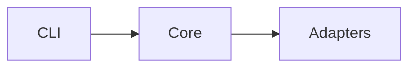

<!-- engineering-memory:install -->
<!-- PROTOTYPE — candidate Memory Install drop-in for docs/architecture.md.
     Not production Store content. React to sections, stub depth, and deep-dive linking.
     Install keeps the marker line; strips this PROTOTYPE comment only. -->

# Architecture

Living map of this repo’s **modules** and **seams** for agents and humans.
Domain names come from [`CONTEXT.md`](../CONTEXT.md). Hard decisions live in [`docs/adr/`](adr/). Coding defaults live in [`docs/conventions.md`](conventions.md).

**How to use:** load this file when a change touches structure (new seam, renamed module, crossed package). Prefer a linked deep-dive over growing this file past a skim. Write what is true **today** — not a target architecture.

## System shape

<!-- One short paragraph, then optional bullet list or mermaid of the handful of top-level modules and how they relate. Topology only — put Interface detail under Key seams. -->

_TODO: name the top-level modules and how they relate._

<!-- Example (delete when real):

-->

## Key seams

<!-- Bullet list. Fixed recipe per item — use codebase-design vocabulary (Module, Interface, Seam, Adapter); never “service,” “API,” or “boundary.” -->

- _TODO: **SeamName** — Interface: what callers must know; varies: what adapters swap across the seam._

## Deep-dives

Subsystem detail lives under [`docs/architecture/`](architecture/) as kebab-case files, linked from this table when earned. Do not pre-seed stubs. Relative link form from this file: `architecture/<kebab-slug>.md`.

| Deep-dive | When to open it |
|-----------|-----------------|
| _(none yet)_ | Add a row when a subsystem has earned its own home. |

<!-- On first earn: replace the _(none yet)_ row (do not leave it beside real rows). Example:
| [billing-write-model](architecture/billing-write-model.md) | Write-path modules, outbox seam, payment adapters |
-->

## Out of scope for this doc

Runtime runbooks, ticket trackers / wayfinder maps, and ADR rationale dumps. Point elsewhere; keep this file a map of structure.
