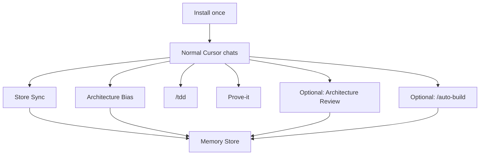

# Genesis

Cursor package for vibe coding without the codebase going unmaintainable.

Agents keep architecture and product docs up to date while you work. You install once. After that it runs on its own in normal chats.

[](package.json)
[](https://cursor.com)

```bash
node skills/memory-install/scripts/memory-install.mjs --project /path/to/your-repo
```

Built on [Matt Pocock's skills](https://github.com/mattpocock/skills) — TDD, grilling, wayfinder, to-tickets, codebase-design, domain-modeling, architecture review, and the local-markdown issue tracker pattern. Genesis packages those (or evolved copies), then adds the Memory Store, always-on Loop, Prove-it, Auto-build, and Install.

---

## Who this is for

People who build with Cursor by prompting, and want the agent to remember project structure and product goals across chats instead of reinventing them each time.

## What it does

1. **Memory Store** — docs in your repo: architecture, product intent, glossary, ADRs, conventions
2. **Memory Loop** — always-on Cursor rule + skills so agents load those docs, update them when the code shape changes, use TDD, and verify the app actually works before Done



## How a normal session works

You do not run a separate memory workflow. Open Cursor and work.

1. **Start** — Agent loads relevant Store docs from the `AGENTS.md` Genesis index (`## Engineering Memory`). If the session will edit code, it always loads `docs/architecture.md` (and linked deep-dives). If the session touches product identity/goals, it also loads `docs/product.md`.
2. **While coding** — Uses `/tdd` when writing or changing code. Prefers clear seams and deep modules (Architecture Bias). Updates Store docs in the same change batch when modules, seams, folders, conventions, or real product goals change.
3. **Before Done** — Runs Prove-it: boot the app, check every Destination-named user path, fix failures. Architecture docs must match the code (leftover Install `_TODO_`s with real modules = not Done).
4. **End** — Writes back any other material Store updates before finishing.

If the Store was never installed, the agent notes that and continues without inventing a full corpus.

## Always-on habits

| Habit | What it does |
|-------|----------------|
| **Store Sync** | Load and update the Memory Store. Same-batch writes when structure or product intent changes. Architecture freshness check before Done. |
| **Architecture Bias** | Soft defaults for deep modules and clear seams. Prefer updating architecture over a short-term hack. ADRs win on hard overrides. |
| **/tdd** | Use the packaged TDD skill when writing or changing code. |
| **Prove-it** | Boot, exercise real user paths, check the UI looks finished. Passing unit tests alone is not Done. On failure: fix and re-check. |

### Architecture Bias: ordinary vs plan-sized

Not every change needs a planning stop.

| Size | What happens |
|------|----------------|
| **Ordinary stretch** | Design the extension → implement → write the Store in the same batch. |
| **Plan-sized** | Change is too big or unclear to code safely first (new major seam, cross-cutting reshape, fuzzy module boundaries). Agent stops implementing (unless you override), runs a planning pass outside the Store, folds decisions into the Store, then implements. |

**Plan-sized planning modes** (agent asks unless you already set a preference):

| Mode | How much it asks you |
|------|----------------------|
| **Automatic** | Agent recommendations throughout; asks only if blocked. |
| **Critical only** | Asks only the highest-stakes questions; recommendations elsewhere. **Default if unset.** |
| **Full grill** | Asks on each decision and waits. |

Planning uses Wayfinder (maps live under `.scratch/`, not in the Store). When the plan Destination is met, durable outcomes fold into the Store, then code starts. Automatic still does fold-back — it does not skip writing the Store.

### Prove-it bar

Before Done / ready-for-user:

- Run commands in-session before telling you to run them locally
- Boot (prefer debug/dev), check **every** Destination-named user path (not happy-path only)
- Surfaces should look complete (no blank/placeholder chrome on paths checked)
- For games / motion / graphical UI: play/feel has to hold up, not just pass a checklist
- On failure: debug → fix → re-run. Gap report only for a hard blocker (credentials, user-only machine state, etc.)

## Core skills (what they actually do)

### `/tdd` (from Matt Pocock's skills)

Red → green, one vertical slice at a time.

- Write a **failing** test first, then only enough code to pass it
- Tests hit **public seams** (interfaces), not internals
- Confirm which seams to test with you before writing tests
- Avoids common failure modes: tests glued to implementation, tautological asserts, and writing a giant test suite before any code

Genesis makes this always-on when code is written or changed. Detail lives in the skill; the Loop just requires using it.

### Wayfinder (`/wayfinder`) (from Matt Pocock's skills)

For work too big or unclear for one chat. You name a **Destination** (what “done planning” looks like — usually a locked spec or decision). Wayfinder charts a **map** of investigation tickets and works them until the route is clear.

Default in this package: local markdown under `.scratch/<effort>/`:

| Artifact | Role |
|----------|------|
| `map.md` | Destination, Notes, Decisions so far, fog / out of scope |
| `issues/NN-*.md` | One ticket per question; types: research, prototype, grilling, task |
| Blocking edges | `Blocked by:` lines; **frontier** = open + unblocked + unclaimed |

Ticket types:

| Type | Who drives it | Purpose |
|------|---------------|---------|
| **Research** | Agent (AFK) | Read docs/code/APIs; link a summary |
| **Prototype** | You + agent | Cheap concrete artifact to react to |
| **Grilling** | You + agent | Decision interview, one question at a time |
| **Task** | Agent or you | Unblock a decision (signup, access, data move) |

Wayfinder is **planning by default** — decisions, not the final product. Maps stay outside the Memory Store. When decisions lock, durable bits fold into Store docs; then you implement (or `/to-tickets` + `/drain-tickets` / `/auto-build` do).

### Grilling (`/grill-me`, `/grill-with-docs`) (from Matt Pocock's skills)

Interview about the plan until you share an understanding. One question at a time, with a recommended answer each time. Facts get looked up in the repo; decisions stay yours.

`/grill-with-docs` also runs domain-modeling so glossary / ADR outcomes can land as you go.

Under `/auto-build`, involvement level controls how often it waits vs auto-accepts recommendations.

### `/to-tickets` (from Matt Pocock's skills)

Turns a locked spec/plan into **tracer-bullet** tickets: each slice is a narrow end-to-end path (not “all schema then all UI”), sized for one fresh agent context, with **Blocked by** edges.

You can quiz/edit the breakdown (`more` / `max` under auto-build), or publish straight to `ready-for-agent`.

### `/drain-tickets`

Orchestrator only. Walks the frontier of `ready-for-agent` tickets, claims one, spawns a **fresh** implement subagent with a full brief, marks resolved, repeats until empty. Then Prove-it + architecture freshness before Done.

### `/prove-it`

Simulation QA playbook (Genesis): inventory Destination paths → debug/dev boot → walk every path → vision check → play/feel when in scope. Always-on rule says when Done requires it; this skill is the procedure.

### `/improve-codebase-architecture` (Architecture Review)

Deepening pass evolved from Matt Pocock’s architecture skill: explore → candidate report → you pick → grill → fold into the Memory Store. Vocabulary comes from `/codebase-design` (deep modules, seams, interfaces).

### `/codebase-design` · `/domain-modeling` (from Matt Pocock's skills)

Shared vocabulary and doc habits: deep modules / seams for architecture work; glossary + ADRs for domain language. Used by Review, Bias, and grill-with-docs — usually not something you invoke alone every day.

## Example workflows

### 1. Small feature while vibing

You: “Add a dark mode toggle on settings.”

What happens without you managing docs:

1. Agent loads architecture (and product docs if needed)
2. Implements with `/tdd` at agreed seams
3. Updates architecture/conventions if the change adds a real seam or module
4. Before Done: boots the app, clicks the settings path, checks the UI looks finished
5. Session ends with Store matching the code

### 2. Bigger change that needs a design stop

You: “Split payments into its own module and support Stripe + a fake provider.”

Likely plan-sized. Agent stops coding and offers:

- **Automatic** / **Critical only** (default) / **Full grill**

Then Wayfinder charts the architecture/product decisions under `.scratch/…`. When Destination is met, fold-back updates `docs/architecture.md` (and ADRs if earned), then implementation runs under Sync + `/tdd` + Prove-it.

### 3. AFK one-shot from a prompt

You: `/auto-build none`  
(or mid-thread after you’ve already described the product)

Pipeline:

1. Involvement = none (full auto)
2. Grill-with-docs — recommendations auto-accepted
3. Wayfinder until `.scratch/<effort>/spec.md` (or equivalent) is locked
4. `/to-tickets` — all `ready-for-agent`
5. `/drain-tickets` — one fresh implement subagent per ticket
6. `/prove-it` + architecture freshness
7. Short done report

Use `medium` / `more` / `max` if you want checkpoints on scope, ticket shape, or drain start.

### 4. Interactive plan, then implement yourself in pieces

1. `/grill-with-docs` on the idea
2. `/wayfinder` until Destination = full spec
3. `/to-tickets` — review the breakdown
4. `/drain-tickets .scratch/<feature>/` — or claim tickets one at a time manually
5. Normal always-on Sync / TDD / Prove-it on each implement chat

### 5. Architecture has drifted

You: `/improve-codebase-architecture`

Explore → HTML candidates → you pick → grill → Store fold-back. Next coding sessions load the updated corpus instead of guessing.

## Optional workflows (reference)

### Architecture Review

1. Load Store  
2. Explore walk  
3. Temp HTML candidate report → you pick  
4. Grill (+ domain-modeling as needed)  
5. Fold into Store  
6. Implement under Sync + `/tdd` if code follows  

### Auto-build involvement

| Level | What you get asked |
|-------|--------------------|
| **none** | Full auto. Accepts grill recommendations. No ticket quiz. Drain starts on its own. Asks only if hard-blocked. |
| **less** | Same as none by default; pauses on a block or a single irreversible fork. |
| **medium** | Asks only highest-stakes decisions (scope, Destination shape, hard Store overrides). |
| **more** | Asks on major design branches; confirms the ticket breakdown before publish. |
| **max** | Full HITL: one grill question at a time; quiz tickets; confirm before drain. |

Outside `/auto-build`, `/grilling` and `/wayfinder` stay normal interactive tools.

## What's in the Store

Created in your project on Install. Existing filled-in docs are not overwritten by newer package stubs.

| File | Purpose |
|------|---------|
| `CONTEXT.md` | Domain glossary |
| `docs/product.md` | Product identity, goals, non-goals |
| `docs/architecture.md` | System shape + top-level seams |
| `docs/architecture/` | Extra detail for specific subsystems (added when earned) |
| `docs/adr/` | Hard decisions |
| `docs/conventions.md` | Coding defaults |

Plans, idea dumps, and draft PRDs stay outside the Store (usually `.scratch/`) until decisions are final and fold back.

`AGENTS.md` gets an `## Engineering Memory` section (Genesis Loop index) that points at the Store and Loop. That section is an index, not Store content.

## Install

Requires Node ≥ 20, Cursor, and a target repo.

From this package:

```bash
node skills/memory-install/scripts/memory-install.mjs --project /path/to/target-repo
```

Every run:

1. **Globals** — Overwrites the always-on rule + package-owned skills under `~/.cursor/rules/` and `~/.agents/skills/` with the packaged versions. Memory Install is the only updater for those globals.
2. **Project** — Creates missing Store files + the `AGENTS.md` section. Skips content you already own. On conflict, offers interactive merge. Does not auto-upgrade living Store docs when package stubs change.

Safe to re-run. Skill list: `skills/DEPENDENCIES.md`.

Genesis’s own tracker docs live under `docs/agents/` (local markdown `.scratch/` layout), same pattern as Matt Pocock’s setup skill configures for a repo.

Non-standard architecture filenames elsewhere in the repo are left alone; Install can still add `docs/architecture.md` if missing.

## Day to day cheat sheet

| Goal | What to do |
|------|------------|
| Normal feature work | Just chat. Sync / Bias / TDD / Prove-it are always on. |
| Big structural change | Expect the plan-sized chooser (Automatic / Critical only / Full grill). |
| Docs drifted from code | `/improve-codebase-architecture` |
| Build a whole feature/product AFK | `/auto-build none` |
| Same pipeline, more control | `/auto-build medium` (or `more` / `max`) |
| Plan only, implement later | `/wayfinder` then `/to-tickets` when ready |
| Refresh globals + repair missing Store files | Re-run Memory Install |

## Credits

Uses tooling from [mattpocock/skills](https://github.com/mattpocock/skills): TDD, grilling, wayfinder, to-tickets, codebase-design, domain-modeling, architecture-improvement workflows, and the issue-tracker / triage / domain-doc setup pattern (`/setup-matt-pocock-skills` on upstream).

Genesis installs those (or evolved copies) for Cursor, adds the always-on Memory Loop, Prove-it, and Auto-build, and keeps living project knowledge in the Memory Store.

## Package map

| Path | Role |
|------|------|
| `rules/engineering-memory.mdc` | Always-on rule |
| `skills/memory-install/` | Install CLI + templates |
| `skills/improve-codebase-architecture/` | Architecture Review |
| `skills/auto-build/` | One-shot build pipeline |
| `skills/wayfinder/` · `to-tickets/` · `drain-tickets/` | Plan → tickets → implement |
| `skills/prove-it/` · `skills/tdd/` | Prove + TDD |
| `skills/grill-me/` · `grill-with-docs/` | Grill aliases |
| `skills/codebase-design/` · `domain-modeling/` · `grilling/` | Upstream-style helpers |
| `AUTO-BUILD.md` | Auto-build brief |
| `CONTEXT.md` | Glossary for this package |

## Tests

```bash
npm test
```

## Status

v0.1, Cursor-only. Globals refresh on every Install. Project Store content is yours; it grows through Sync, Review, or merge.
