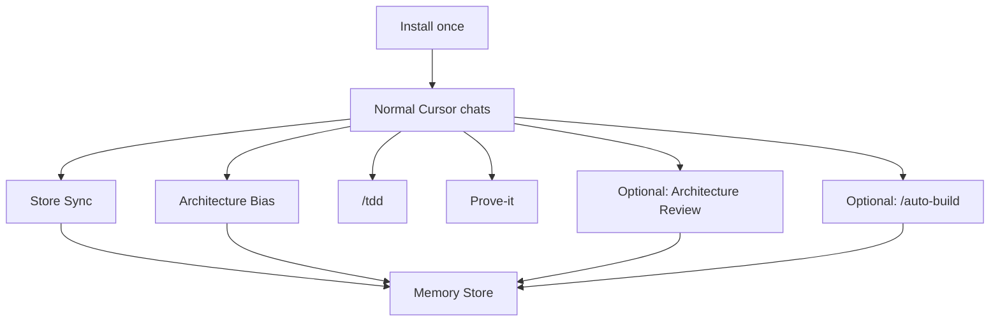

# Engineering Memory

Cursor package for vibe coding without the codebase going unmaintainable.

Agents keep architecture and product docs up to date while you work. You install once. After that it runs on its own in normal chats.

[](package.json)
[](https://cursor.com)

```bash
node skills/memory-install/scripts/memory-install.mjs --project /path/to/your-repo
```

---

## Who this is for

People who build with Cursor by prompting, and want the agent to remember project structure and product goals across chats instead of reinventing them each time.

## What it does

1. **Memory Store** — docs in your repo: architecture, product intent, glossary, ADRs, conventions
2. **Memory Loop** — always-on Cursor rule + skills so agents load those docs, update them when the code shape changes, use TDD, and verify the app actually works before Done



## How a normal session works

You do not run a separate memory workflow. Open Cursor and work.

1. **Start** — Agent loads relevant Store docs from the `AGENTS.md` Engineering Memory index. If the session will edit code, it always loads `docs/architecture.md` (and linked deep-dives). If the session touches product identity/goals, it also loads `docs/product.md`.
2. **While coding** — Uses `/tdd` when writing or changing code. Prefers clear seams and deep modules (Architecture Bias). Updates Store docs in the same change batch when modules, seams, folders, conventions, or real product goals change.
3. **Before Done** — Runs Prove-it: boot the app, check every Destination-named user path, fix failures. Architecture docs must match the code (leftover Install `_TODO_`s with real modules = not Done).
4. **End** — Writes back any other material Store updates before finishing.

If the Store was never installed, the agent notes that and continues without inventing a full corpus.

## Always-on habits

| Habit | What it does |
|-------|----------------|
| **Store Sync** | Load and update the Memory Store. Same-batch writes when structure or product intent changes. Architecture freshness check before Done. |
| **Architecture Bias** | Soft defaults for deep modules and clear seams. Prefer updating architecture over a short-term hack. ADRs win on hard overrides. |
| **/tdd** | Use the packaged TDD skill when writing or changing code. |
| **Prove-it** | Boot, exercise real user paths, check the UI looks finished. Passing unit tests alone is not Done. On failure: fix and re-check. |

### Architecture Bias: ordinary vs plan-sized

Not every change needs a planning stop.

| Size | What happens |
|------|----------------|
| **Ordinary stretch** | Design the extension → implement → write the Store in the same batch. |
| **Plan-sized** | Change is too big or unclear to code safely first (new major seam, cross-cutting reshape, fuzzy module boundaries). Agent stops implementing (unless you override), runs a planning pass outside the Store, folds decisions into the Store, then implements. |

**Plan-sized planning modes** (agent asks unless you already set a preference):

| Mode | How much it asks you |
|------|----------------------|
| **Automatic** | Agent recommendations throughout; asks only if blocked. |
| **Critical only** | Asks only the highest-stakes questions; recommendations elsewhere. **Default if unset.** |
| **Full grill** | Asks on each decision and waits. |

Planning uses Wayfinder (maps live under `.scratch/`, not in the Store). When the plan Destination is met, durable outcomes fold into the Store, then code starts. Automatic still does fold-back — it does not skip writing the Store.

### Prove-it bar

Before Done / ready-for-user:

- Run commands in-session before telling you to run them locally
- Boot (prefer debug/dev), check **every** Destination-named user path (not happy-path only)
- Surfaces should look complete (no blank/placeholder chrome on paths checked)
- For games / motion / graphical UI: play/feel has to hold up, not just pass a checklist
- On failure: debug → fix → re-run. Gap report only for a hard blocker (credentials, user-only machine state, etc.)

## Optional workflows

### Architecture Review (`/improve-codebase-architecture`)

Use when architecture docs are stubbed or stale, Sync keeps thrashing, or the agent cannot answer a structure question from the Store. Also useful at milestones or after a big auto-build.

Process:

1. Load Store
2. Explore walk of the codebase
3. Temp HTML candidate report → you pick what to deepen
4. Grill (+ domain-modeling as needed)
5. Fold decisions into the Store (architecture, glossary, offer ADRs, conventions)
6. Implement under normal Store Sync + `/tdd` if code follows

### Auto-build (`/auto-build`)

One-shot pipeline from the current chat (or a fresh prompt). Mid-chat, the seed is the whole conversation history. Fresh chat = the starting prompt.

**Pipeline (fixed order):**

0. Pick involvement level (or pass it on the invoke, e.g. `/auto-build none`)
1. Orient — name Destination from the seed
2. Grill-with-docs — lock major design branches
3. Wayfinder — map + full spec under `.scratch/<effort>/`
4. `/to-tickets` — vertical slices, all `ready-for-agent`
5. `/drain-tickets` — implement each ticket (fresh subagent per ticket)
6. `/prove-it` + architecture freshness
7. Short done report

**Involvement levels:**

| Level | What you get asked |
|-------|--------------------|
| **none** | Full auto. Accepts grill recommendations. No ticket quiz. Drain starts on its own. Asks only if hard-blocked. |
| **less** | Same as none by default; pauses on a block or a single irreversible fork. |
| **medium** | Asks only highest-stakes decisions (scope, Destination shape, hard Store overrides). |
| **more** | Asks on major design branches; confirms the ticket breakdown before publish. |
| **max** | Full HITL: one grill question at a time; quiz tickets; confirm before drain. |

Outside `/auto-build`, `/grilling` and `/wayfinder` stay normal interactive tools.

### Other useful commands

| Command | Role |
|---------|------|
| `/grill-me` / `/grill-with-docs` | Decision interview (+ docs/domain when using with-docs) |
| `/wayfinder` | Planning maps and Destination tracking |
| `/to-tickets` | Spec → vertical-slice tickets |
| `/drain-tickets` | Implement ready tickets until the frontier is empty |
| `/tdd` | Test-driven implementation |
| `/prove-it` | Runtime / path / vision check playbook |

## What's in the Store

Created in your project on Install. Existing filled-in docs are not overwritten by newer package stubs.

| File | Purpose |
|------|---------|
| `CONTEXT.md` | Domain glossary |
| `docs/product.md` | Product identity, goals, non-goals |
| `docs/architecture.md` | System shape + top-level seams |
| `docs/architecture/` | Extra detail for specific subsystems (added when earned) |
| `docs/adr/` | Hard decisions |
| `docs/conventions.md` | Coding defaults |

Plans, idea dumps, and draft PRDs stay outside the Store (usually `.scratch/`) until decisions are final and fold back.

`AGENTS.md` gets an `## Engineering Memory` section that points at the Store and Loop. That section is an index, not Store content.

## Install

Requires Node ≥ 20, Cursor, and a target repo.

From this package:

```bash
node skills/memory-install/scripts/memory-install.mjs --project /path/to/target-repo
```

Every run:

1. **Globals** — Overwrites the always-on rule + package-owned skills under `~/.cursor/rules/` and `~/.agents/skills/` with the packaged versions. Memory Install is the only updater for those globals.
2. **Project** — Creates missing Store files + the `AGENTS.md` section. Skips content you already own. On conflict, offers interactive merge. Does not auto-upgrade living Store docs when package stubs change.

Safe to re-run. Skill list: `skills/DEPENDENCIES.md`.

Non-standard architecture filenames elsewhere in the repo are left alone; Install can still add `docs/architecture.md` if missing.

## Day to day cheat sheet

| Goal | What to do |
|------|------------|
| Normal feature work | Just chat. Sync / Bias / TDD / Prove-it are always on. |
| Big structural change | Expect the plan-sized chooser (Automatic / Critical only / Full grill). |
| Docs drifted from code | `/improve-codebase-architecture` |
| Build a whole feature/product AFK | `/auto-build none` |
| Same pipeline, more control | `/auto-build medium` (or `more` / `max`) |
| Refresh globals + repair missing Store files | Re-run Memory Install |

## Package map

| Path | Role |
|------|------|
| `rules/engineering-memory.mdc` | Always-on rule |
| `skills/memory-install/` | Install CLI + templates |
| `skills/improve-codebase-architecture/` | Architecture Review |
| `skills/auto-build/` | One-shot build pipeline |
| `skills/wayfinder/` · `to-tickets/` · `drain-tickets/` | Plan → tickets → implement |
| `skills/prove-it/` · `skills/tdd/` | Prove + TDD |
| `skills/grill-me/` · `grill-with-docs/` | Grill aliases |
| `AUTO-BUILD.md` | Auto-build brief |
| `CONTEXT.md` | Glossary for this package |

## Tests

```bash
npm test
```

## Status

v0.1, Cursor-only. Globals refresh on every Install. Project Store content is yours; it grows through Sync, Review, or merge.
